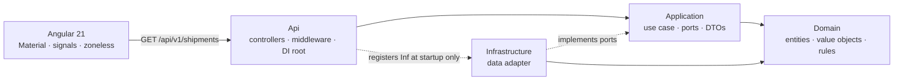
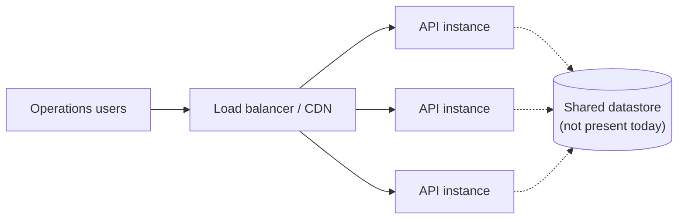

# Daklapack Shipment Monitor

[](https://github.com/sbondai/daklapack-shipment-monitor/actions/workflows/ci.yml)

An operations view for monitoring Daklapack shipment orders: a .NET 10 REST API and an Angular 21
front end built with Angular Material.

Runs with no database, no Docker and no connection string — `dotnet run` and `npm start`.

---

## Quick start

**Prerequisites:** [.NET 10 SDK](https://dotnet.microsoft.com/download/dotnet/10.0) and
[Node.js](https://nodejs.org) 20.19+, 22.12+ or 24.

```shell
# terminal 1 — API on http://localhost:5180
dotnet run --project src/DaklaPack.Shipments.Api

# terminal 2 — web app on http://localhost:4200
cd src/DaklaPack.Shipments.Web
npm install
npm start
```

Open <http://localhost:4200>. The dev server proxies `/api/*` to the API, so the browser makes
same-origin calls and CORS never enters the picture in development.

The API's OpenAPI document is at `/openapi/v1.json`, with a browsable UI at `/scalar/v1`
(development only). Health check at `/health`.

```shell
dotnet format --verify-no-changes   # formatting gate
dotnet build --configuration Release
dotnet test                         # 164 tests: unit, architecture, contract

cd src/DaklaPack.Shipments.Web
npm run lint                        # fails on any `any`
npm test -- --watch=false           # 54 tests
npm run build
```

CI runs exactly these commands on every push and pull request.

---

## Architecture



Four projects, with **the dependency arrow pointing inward at every layer**. `Domain` references
nothing at all — its `.csproj` has no package references, which is the layering claim made concrete
rather than asserted. `Application` declares `IShipmentRepository`; `Infrastructure` implements it;
`Api` is the only project aware of both, and only at the composition root.

That is enforced mechanically, not by convention: `ArchitectureTests` fails the build if a `using`
crosses a boundary.

```
src/
  DaklaPack.Shipments.Domain/          no dependencies at all
  DaklaPack.Shipments.Application/     → Domain
  DaklaPack.Shipments.Infrastructure/  → Application, Domain
  DaklaPack.Shipments.Api/             → Application, Infrastructure
  DaklaPack.Shipments.Web/             Angular workspace (built by ng, not by MSBuild)
tests/
  DaklaPack.Shipments.UnitTests/       domain + application
  DaklaPack.Shipments.ArchitectureTests/
  DaklaPack.Shipments.ContractTests/   HTTP and JSON contract
```

The Angular app is **not** hosted inside the API project. Coupling `dotnet build` to npm makes the
backend unbuildable without Node, and static files belong on a CDN rather than being served by
Kestrel. They are separate artefacts in one repository, talking HTTP.

---

## API

`GET /api/v1/shipments`

| Parameter | Type | Default | Behaviour |
|---|---|---|---|
| `status` | enum | all | Case-insensitive. `Created`, `InTransit`, `OutForDelivery`, `Delivered`, `Delayed`, `Cancelled` |
| `sortBy` | enum | `DispatchedAt` | Allowlisted by the enum, so no caller text reaches the query builder |
| `sortOrder` | enum | `Desc` | `Asc` / `Desc` |
| `page` | int, 1-based | `1` | Below 1 → `400` |
| `pageSize` | int | `25` | Below 1 → `400`. Above 100 → **clamped**, not rejected |

```jsonc
{
  "items": [{
    "id": "…",
    "trackingId": "DP-2026-100035",
    "status": "InTransit",                        // string, never numeric
    "weightKg": 25.9,
    "destination": { "city": "Amsterdam", "countryCode": "NL", "postalCode": "1011AB" },
    "carrier": "PostNL",
    "dispatchedAt": "2026-08-20T09:15:00+02:00",  // an instant
    "estimatedDeliveryOn": "2026-08-25",          // a calendar date
    "isOverdue": false
  }],
  "page": 1,
  "pageSize": 25,      // the EFFECTIVE size after clamping
  "totalCount": 40,
  "totalPages": 2
}
```

A page beyond the last returns `200` with an empty `items` array and the correct `totalCount` — an
overshoot is navigation, not an error. Failures are RFC 7807: `ValidationProblemDetails` for `400`
with a field-level `errors` map, `ProblemDetails` otherwise.

---

## Design decisions

**Malformed is rejected; excessive is clamped.** `page=0` is a `400`. `pageSize=5000` returns `200`
with 100 rows and reports the size actually applied, so a client paginator stays in step. A
monitoring UI asking for too much should be given the maximum, not an error.

**Ordering always closes with the shipment id.** Every sortable field is non-unique, and paging over
a non-total ordering lets rows repeat or vanish between pages. The tiebreaker costs one clause; the
bug it prevents is the kind that gets blamed on the database.

**Instants and calendar dates are different types, and stay different.** `dispatchedAt` is a
`DateTimeOffset` shown in the viewer's local zone. `estimatedDeliveryOn` is a `DateOnly` rendered
verbatim by a dedicated pipe that never constructs a `Date`. Angular's `DatePipe` cannot format a
calendar date correctly: it parses `"2026-09-03"` into UTC midnight and then offsets it, which shows
the wrong day. There is no offset that is right to apply to a day a human agreed to.

**No mediator.** For one query handler, `IMediator.Send()` is indirection that makes call sites
harder to navigate in exchange for a pipeline that isn't needed. Validation is handled by
`[ApiController]`, exceptions by a global `IExceptionHandler` — the two concerns a pipeline would
have carried. The handler signature already fits `IRequestHandler` if that changes.

**Mapperly, not AutoMapper.** Source-generated at compile time, so a renamed property is a build
error rather than a runtime surprise, the generated code is steppable, and startup costs nothing.

**The repository port exists for dependency inversion, not mockability.** `DbContext` is already a
Unit of Work over `IQueryable`; wrapping it to mock the database produces tests that pass against a
fake and fail against a real store. The port is here so `Application` never references a persistence
package. Implementations are verified by a shared contract suite instead.

**Monitoring and browsing are different behaviours.** Offset paging keeps jump-to-page for browsing
history, but polling runs *only on page 1* — on later pages the operator is reading a stable set and
refreshing underneath them would shift rows mid-scan. The footer states whether the view is live or
paused, because a dashboard that quietly changes its own refresh behaviour is worse than one that
never refreshed.

**A change is announced, not counted.** When a poll finds the results have moved, the UI says
"results have changed" and offers a refresh rather than replacing rows underneath the reader. It
deliberately does **not** report a number: the only cheap signal is the difference in `totalCount`,
and that is a *net* change — one shipment arriving while another leaves the filter nets to zero, and
a status change can move a row in or out without anything arriving. Reporting "3 new" from that
arithmetic would be a number the server never claimed. An exact count needs a change cursor from the
API.

**An empty page is two different problems.** `totalCount == 0` means nothing matches the filter, and
that is what the UI says. But an empty page when matches exist on earlier pages is a *navigation*
problem — the results shrank while the operator was on page four. Collapsing both into "no shipments
found" would be false and would also remove the paginator, stranding them. The page envelope is kept
and a **Go to last page** action is offered instead.

**Overdue is judged in Amsterdam, not UTC.** "Overdue" is a claim about a business day. UTC changes
date at 02:00 Amsterdam in summer, so a UTC calendar would report a shipment as on time for the
first two hours of the local working day. The business time zone is configurable
(`ShipmentMonitor:BusinessTimeZone`) and defaults to `Europe/Amsterdam`, with tests pinning the
midnight boundary.

**The frontend state is a discriminated union**, not three booleans:

```ts
type RequestState<T> =
  | { status: 'idle' } | { status: 'loading' } | { status: 'loaded'; data: T }
  | { status: 'empty' } | { status: 'error'; error: ApiError };
```

`loading && error` becomes unrepresentable, and the data only exists in the state where it has
actually loaded. Exhaustiveness is enforced in TypeScript via an `assertNever`, **not** in the
template — an Angular `@switch` performs no `never` checking, so a missing arm would compile and
silently render nothing.

**Logic lives in the store, not the component.** `ShipmentStore` owns request state, retries, the
polling policy, and the single place Material's zero-based `pageIndex` becomes the API's one-based
`page`. Filter changes go through `switchMap`, so rapid clicks cannot deliver out of order. The page
component reads signals and forwards events.

---

## Testing

| Tier | Count | Answers |
|---|---:|---|
| Unit — domain | | Invariants; `IsOverdue` at its boundaries |
| Unit — application | | Filtering, sort direction, tiebreaker, clamping, page arithmetic, overflow |
| *(both in `UnitTests`)* | 91 | |
| Architecture | 15 | Did anyone cross a layer boundary or leak an entity onto the wire? |
| Contract | 58 | Real HTTP: status codes, casing, string enums, date formats, paging, conditional requests, problem responses |
| Angular | 54 | Query construction, state machine, cancellation, paginator conversion, polling policy, empty-page recovery, date rendering |

**The architecture tests assert against the compiler's own reference list**, not namespace patterns.
A namespace rule passes silently when its pattern matches nothing, and a rule that cannot fail is
worse than no rule — it reports success while checking nothing. Each rule here was verified by
injecting a deliberate violation and confirming the suite goes red.

**The contract tests run the real pipeline** via `WebApplicationFactory`, so routing, model binding,
validation, mapping and serialisation are all exercised. The C# response types and the TypeScript
interfaces are the same contract written twice on either side of a network boundary, and nothing in
either compiler checks that they still agree. These tests are what does.

The page arithmetic carries the heaviest coverage, including two cases that are easy to miss:
clamping must narrow the offset too (page 3 of a requested 5000 skips 200, not 15,000), and the
offset is computed as `long` — as `int` it overflowed for very large pages, wrapped negative, and
served the *first* page with `200 OK`.

Seed data is deterministic — a fixed table with fixed identifiers — but dates are day *offsets* from
a supplied reference date, so the sample always contains a realistic mix of delivered, in-flight and
overdue work while remaining reproducible. Tests inject a fixed `TimeProvider` and assert at a chosen
date rather than depending on the day CI runs.

---

## Accessibility

Status is never signalled by colour alone — the chip keeps its text label (WCAG 1.4.1). Sort headers
carry `sortActionDescription`, because most screen readers do not announce `aria-sort` changes. State
transitions and the live indicator are `aria-live`. The table has a caption. Below 900px the
seven-column table becomes a card list, since a table forced onto a phone is a horizontal scrollbar,
not a structured layout. The footer's live pulse is behind `prefers-reduced-motion`.

---

## Scaling and operations

Stated because "production grade" should mean known limits, not implied ones. The workload here is
one read-only endpoint over a fixed in-memory catalogue, polled by a browser. Everything below is
sized to that, and says what would change it.

### Where this runs



**Instances are stateless and need no session affinity — but only because the catalogue is
immutable and identically seeded.** That is the whole reason replication is safe here, and it is a
property of the data, not an achievement of the design. Introduce writes and replicas diverge
immediately; the answer then is shared durable storage with migrations, concurrency control, and a
stated consistency requirement.

Several processes starting is not high availability. That also needs independent failure domains,
routing that removes unhealthy instances, a deployment strategy, and recovery that has been tested
rather than assumed.

### What was optimised, and why that and not something else

The cost driver is the polling loop: the same page fetched every 15 seconds by every operator
watching. So the work went there rather than into patterns that sound protective but guard nothing.

| | Bytes on the wire |
|---|---:|
| Full JSON page (40 rows) | 12,029 |
| gzip | 2,116 — 82% smaller |
| Repeat poll, unchanged (`304`) | **0** |

A steady-state poll now costs a header exchange. The (weak) `ETag` is computed from the response
bytes, so any change a client would see changes the tag and nothing else does. `If-None-Match` is
evaluated per RFC 9110 — tag lists, `*`, and weak comparison — because getting that wrong fails
open and the optimisation silently stops working. Contract tests prove a different query is never
short-circuited, since a 304 for a page the client does not hold would show stale shipments, which
is worse than not optimising at all.

It is scoped to the shipment routes rather than applied globally: the middleware buffers a response
to hash it, and doing that to the OpenAPI document or anything streamed would cost without paying.

The honest limit: this saves **bandwidth**, not server work. The query still runs. Removing the work
needs a cache, and caching an in-memory array would be theatre — that decision belongs with a real
datastore whose reads are worth avoiding.

### When each decision flips

| Today | Because | Revisit when |
|---|---|---|
| In-memory catalogue | Read-only, fixed dataset, no writes | Any write path, or data that must survive restart |
| No cache | The data is already memory-resident | A datastore exists and read latency is measured, not assumed |
| No rate limiting | One unauthenticated read endpoint; no traffic requirement | The endpoint is public at scale, or a per-customer quota is a business rule |
| No circuit breaker or retry | There is no remote call to protect | A network hop exists — then bounded timeouts, jittered retry on idempotent calls only |
| No queue | Nothing asynchronous in the user story | A workflow needs delivery guarantees or decoupling |
| Offset paging | Jump-to-page matters for browsing history | Deep pages get slow, or a stable snapshot across polls is required |
| Single liveness probe | Readiness asks the same question with no dependency | A datastore exists whose reachability can differ from process health |

Adding any of these now would demonstrate familiarity with the pattern and a poor sense of when it
applies. They are listed so the reasoning is inspectable, not so the list looks longer.

### Operating notes

- **Verify:** `GET /health` for liveness; `GET /api/v1/shipments?pageSize=1` for a real read.
- **Correlate a report:** every problem response carries `traceId`, which matches the request in the
  logs. Ask for it first — it turns "the page broke" into a specific request.
- **Elevated 5xx:** the fault is logged in full server-side with the same `traceId`; the client is
  told nothing beyond a generic message, deliberately.
- **Shutdown:** on `SIGTERM` the host stops accepting new requests and allows in-flight ones **up
  to** 15 seconds to finish; anything still running when the window closes is cut off. Configurable
  via `ShipmentMonitor:ShutdownDrainSeconds`, and it should be set to agree with the orchestrator's
  own grace period — a drain longer than the orchestrator waits buys nothing.
- **Rollback:** the service is stateless with no migrations, so rollback is redeploying the previous
  image. That stops being true the moment a schema exists.

## With more time

- **No authentication or authorisation.** In production this sits behind an operations-role check.
- **No shipment detail view.** `GET /shipments/{trackingId}` and a drill-down are the obvious next step.
- **Offset paging is snapshot-stable only.** It is deterministic within one query but says nothing
  across polls. Cursor paging over an immutable key, or a snapshot token held constant while
  navigating, are the production answers; both are overkill here.
- **Persistence is in-memory.** The port is the seam: an EF Core adapter is a change at the
  composition root, with `Application`, `Domain` and `Api` untouched. Real persistence would bring
  migrations applied as a pipeline step rather than at startup, and integration tests against a real
  database rather than an in-memory provider.
- **Polling, not push.** SignalR is the right answer for live status; the brief asks for a view.
- **Client models are hand-written.** Right at three interfaces, wrong at thirty — generating them
  from the OpenAPI document is the answer at scale.
